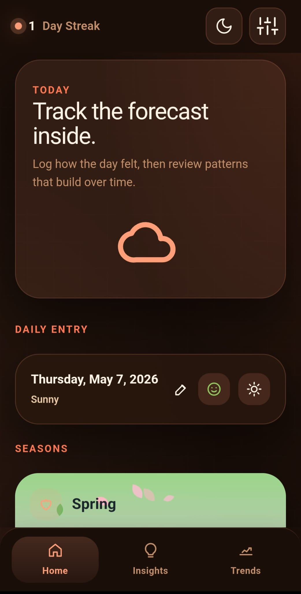
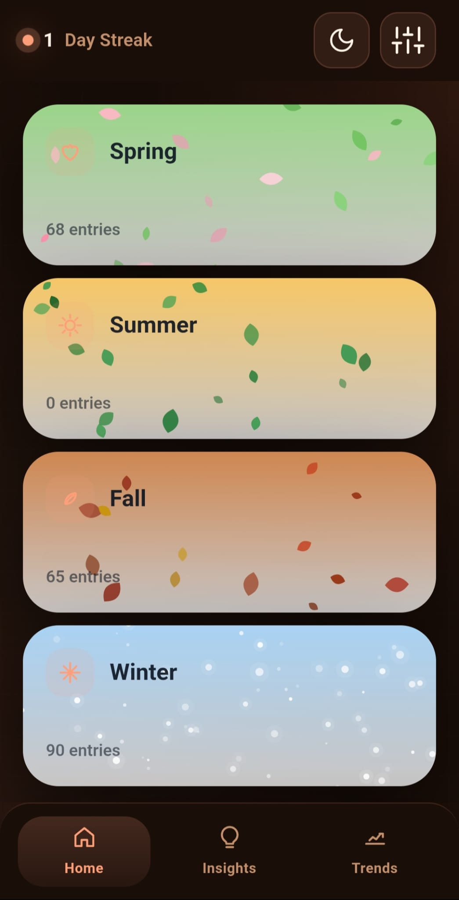
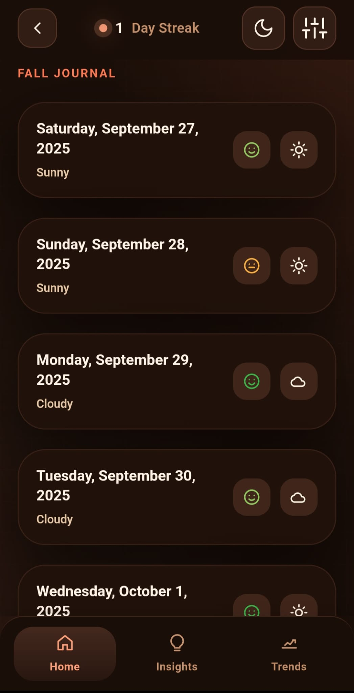
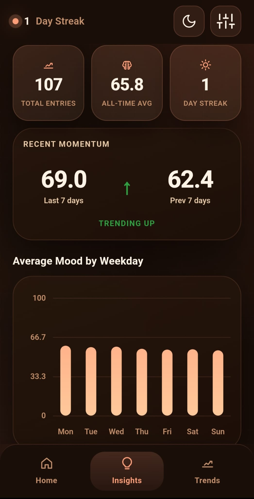
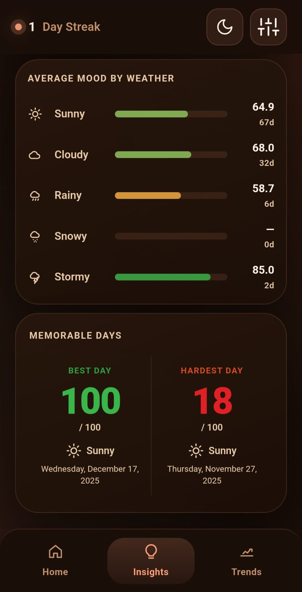
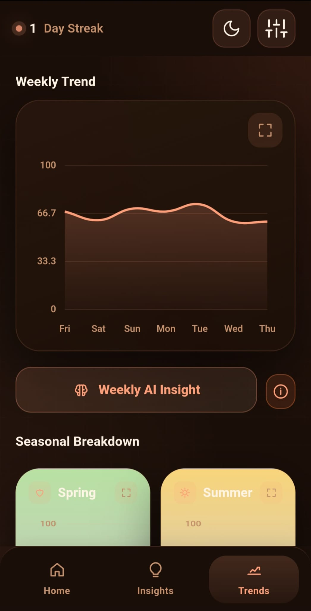
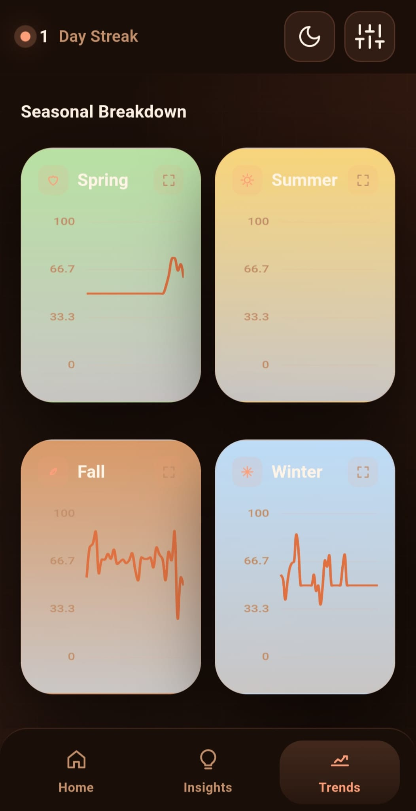
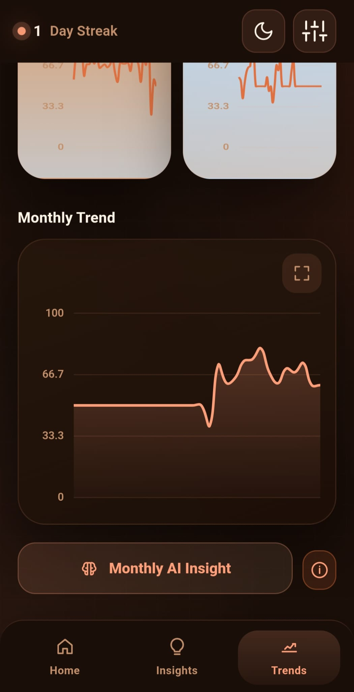

# InnerWeather

A mood-tracking Android app built with **Capacitor 6 + Vanilla JavaScript**.
Log a daily mood score, weather, and notes. The app surfaces trends, insights, and AI-generated weekly/monthly summaries of your emotional patterns.

---

## Screenshots

<p align="center">
  
  
  
  
  
  
  
  
</p>

---

## Stack

| Layer | Technology |
|---|---|
| Runtime | Capacitor 6 (Android) |
| Bundler | Vite 5 |
| CSS | Tailwind CSS v4 + CSS custom properties |
| Charts | Chart.js |
| Animations | Custom Canvas 2D (leaf fall + snowfall) |
| Auth | Firebase Anonymous Auth |
| Storage | `@capacitor/preferences` |
| Notifications | `@capacitor/local-notifications` |
| AI Summaries | OpenAI GPT-4o-mini via Google Cloud Function |
| Ads | Google AdMob (custom Capacitor plugin) |

---

## Build & Run

```bash
# Install dependencies
npm install

# Local dev server
npm run dev

# Production build
npm run build

# Sync web assets to Android
npm run cap:sync

# Open in Android Studio
npm run cap:android
```

---

## Android Permissions

The following permissions are declared in `AndroidManifest.xml`:

```xml
<uses-permission android:name="android.permission.INTERNET" />
<uses-permission android:name="android.permission.RECORD_AUDIO" />
<uses-permission android:name="android.permission.MODIFY_AUDIO_SETTINGS" />
<uses-permission android:name="android.permission.WRITE_EXTERNAL_STORAGE" android:maxSdkVersion="28" />
```

Post-notification and exact-alarm permissions are requested at runtime via `@capacitor/local-notifications`.

---

## Custom Capacitor Plugins

| Plugin | Java class | Purpose |
|---|---|---|
| `DownloadHelper` | `DownloadPlugin.java` | Save JSON backup to the public Downloads folder (MediaStore on Android 10+, direct file write on Android 9 and below) |
| `AdPlugin` | `AdPlugin.java` | AdMob banner and interstitial ads |
| `AppCheckPlugin` | `AppCheckPlugin.java` | Expose Firebase App Check tokens to JS |

All three are registered in `MainActivity.java` via `registerPlugin()`.
